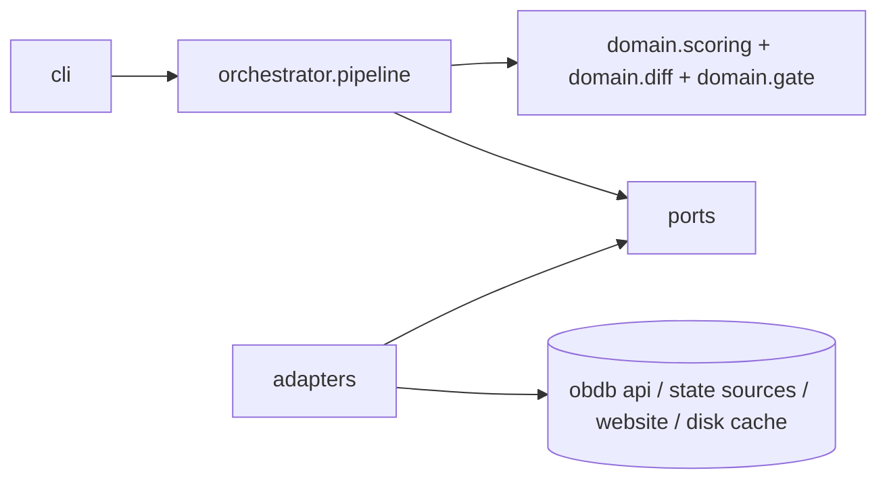
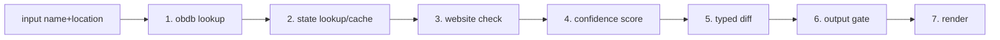
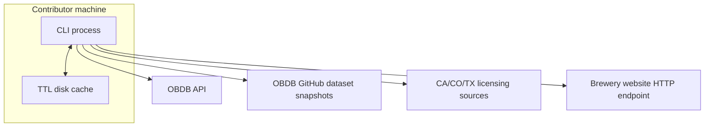

# Architecture Spine — openbrewerydb-research-agent-v0.1

## Design Paradigm

Hexagonal architecture with a deterministic, ordered pipeline core.

- Core domain and orchestrator are pure in-process logic.
- Adapters are boundary implementations (OBDB API, state licensing sources, website HTTP, cache store, render sinks).
- Pipeline order is fixed by architecture, not caller choice.

## Invariants & Rules



### AD-1 — [ADOPTED] Hexagonal boundary with deterministic pipeline core

- **Binds:** FR-2, FR-13, FR-14
- **Prevents:** Ad-hoc cross-calls between source clients and scoring/diff logic that create non-reproducible runs
- **Rule:** Only orchestrator invokes ports; adapters implement ports; domain logic has no direct network/disk dependency

### AD-2 — [ADOPTED] Immutable run-state transition model

- **Binds:** FR-13, FR-14, Determinism NFR, Reliability NFR
- **Prevents:** Hidden in-place state mutation and order-dependent side effects between steps
- **Rule:** Each pipeline step returns a new state snapshot; state transitions use frozen models and explicit `model_copy(update=...)`

### AD-3 — [ADOPTED] Source authority split: runtime lookup vs bulk cache refresh

- **Binds:** FR-1, FR-15
- **Prevents:** Runtime single-brewery lookups drifting to stale bulk cache or bulk refresh implemented as API fan-out
- **Rule:** Runtime single-brewery lookup is OBDB API authoritative; bulk dataset refresh is from OBDB GitHub snapshot source

### AD-4 — [ADOPTED] Unified state-adapter port contract

- **Binds:** FR-2, FR-3
- **Prevents:** State-specific adapter shapes that force custom orchestration branches per state
- **Rule:** Every state adapter implements one contract with `state_code`, `lookup_one`, and `fetch_bulk` and returns normalized license records

### AD-5 — [ADOPTED] Single scoring-and-gate authority

- **Binds:** FR-5, FR-6, FR-7, FR-10
- **Prevents:** Competing confidence logic in render/diff layers and gate bypass paths
- **Rule:** Confidence calculation and threshold gate are owned by one domain module; renderers consume gate result, never recompute it

### AD-6 — [ADOPTED] Error continuity to response is mandatory

- **Binds:** FR-14, Observability NFR
- **Prevents:** Early process aborts that hide partial evidence and step diagnostics
- **Rule:** Step failures are captured in state error payloads and pipeline always reaches response rendering with explicit step outcomes

### AD-7 — [ADOPTED] Evidence-linked typed diff contract

- **Binds:** FR-8, FR-9, FR-10, FR-11, FR-12
- **Prevents:** Unproven field changes and format drift across output paths
- **Rule:** Diff entries are typed and carry field-level evidence refs; copyable CSV is emitted only when gate passes, otherwise evidence-only output

### AD-8 — [ADOPTED] Policy-aware website access behind a single website port

- **Binds:** FR-4, FR-13, FR-14
- **Prevents:** Unethical scraping behavior, adapter-specific orchestration branches, and silent false positives on JS/challenge-protected sites
- **Rule:** Website source access remains behind a single website port contract; orchestrator uses deterministic adapter policy (HTTP first, optional one browser fallback on explicit technical-block predicates), evaluates `robots.txt` before crawl behavior, sends env-configured scraper identity headers, and surfaces `policy_blocked`/`technical_blocked`/`config_error` as structured step errors

## Consistency Conventions

| Concern | Convention |
| --- | --- |
| Naming (entities, files, interfaces, events) | Ports use `*Port` suffix; adapters use `<source>_adapter.py`; pipeline steps use ordered `step_*` naming |
| Data & formats (ids, dates, error shapes, envelopes) | Internal ids are snake_case; timestamps are ISO-8601 UTC; every surfaced step error uses one structured envelope with step id + message + source |
| State & cross-cutting (mutation, errors, logging, config, auth) | Immutable state transitions only; no hidden retries in v0.1; threshold resolved from config then CLI override; no auth secrets in runtime output |
| Website crawl policy and identity | Use policy-aware crawling (`robots.txt`) before crawl behavior and attach env-configured scraper identity header; blocked policy/technical paths return structured step errors |

## Stack

| Name | Version |
| --- | --- |
| Python | 3.13 |

## Structural Seed





```text
obdb/
  agent/
    cli.py                 # command entry
    orchestrator.py        # fixed ordered pipeline
    state.py               # immutable run-state models
  domain/
    scoring.py             # confidence + signal breakdown
    diff.py                # typed field diff
    gate.py                # output gate policy
  ports/
    obdb_port.py
    state_license_port.py
    website_port.py
    cache_port.py
    renderer_port.py
  adapters/
    obdb_api_adapter.py
    ca_license_adapter.py
    co_license_adapter.py
    tx_license_adapter.py
    website_http_adapter.py
    disk_cache_adapter.py
    cli_renderer_adapter.py
```

## Capability → Architecture Map

| Capability / Area | Lives in | Governed by |
| --- | --- | --- |
| 4.1 Source collection and normalization | `ports/*`, `adapters/*`, `agent/orchestrator.py` | AD-1, AD-3, AD-4 |
| 4.2 Deterministic evaluation and gating | `domain/scoring.py`, `domain/gate.py` | AD-2, AD-5 |
| 4.3 Diff and provenance output | `domain/diff.py`, `adapters/cli_renderer_adapter.py` | AD-5, AD-7 |
| 4.4 Pipeline orchestration and resilience | `agent/orchestrator.py`, `agent/state.py` | AD-1, AD-2, AD-6 |

## Deferred

- Add a workflow framework only when in-process orchestration cannot meet reliability/maintainability targets.
- Add per-state threshold tuning in v0.2 when fixture and production signal variance proves global threshold is insufficient.
- Add website retry policy in v0.2 when observed transient failure rate materially impacts confidence outputs.
- Expand deployment model beyond local CLI only when background/shared execution becomes a product requirement.
